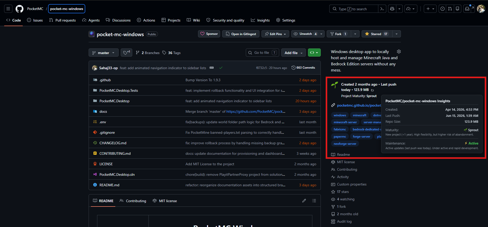
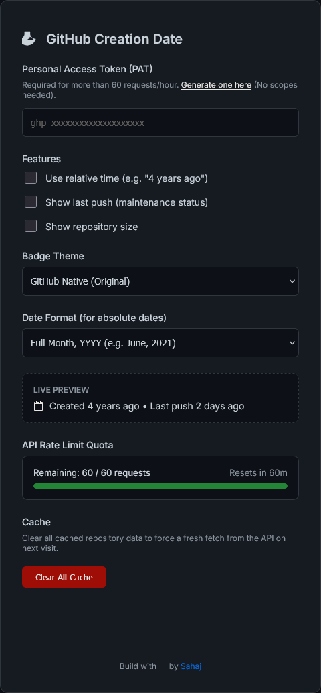
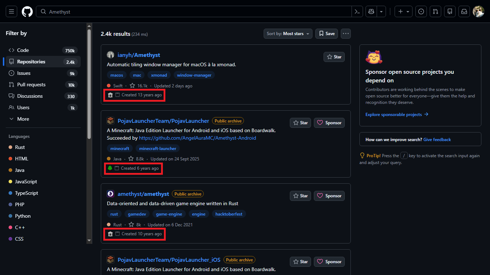
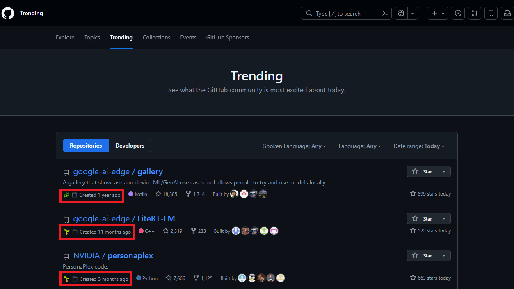

<div align="center">

# GitHub Date of Creation

**Instant project maturity insights, creation timelines, and maintenance health metrics injected seamlessly into GitHub.**

[](https://developer.chrome.com/docs/extensions/mv3/intro/)
[](https://github.com/Sahaj33-op/github-date-of-creation/releases/latest)
[](https://developer.mozilla.org/en-US/docs/Web/JavaScript/Reference/Global_Objects/Intl/DateTimeFormat)
[](https://github.com/Sahaj33-op/github-date-of-creation)
[](https://opensource.org/licenses/MIT)

</div>

---

## Overview

**GitHub Date of Creation** is a lightweight, cross-browser extension that surfaces the age, lifecycle stage, and maintenance health of any repository directly within GitHub's interface. Built natively for **Manifest V3** with zero external dependencies, it eliminates the need to dig through commit histories or release logs to assess software longevity.

---

## Visual Showcase

| Repository Maturity Badge | Redesigned Options & Theme Engine |
| :---: | :---: |
|  |  |

| Search Results Integration | Trending Lists Injection |
| :---: | :---: |
|  |  |

---

## Core Capabilities

### 1. Project Maturity Classification (Lindy Effect)
Repositories are categorized into clear longevity tiers based on the Lindy Rule, predicting future viability through proven survival time:

| Tier | Lifespan | Interpretation |
| :--- | :--- | :--- |
| **Sprout** | `< 1 year` | Early-stage or experimental project. Expect rapid API iteration. |
| **Established** | `1 - 5 years` | Proven codebase with demonstrated adoption and initial stability. |
| **Mature** | `5 - 10 years` | Long-standing foundation with stable architectural patterns. |
| **Ancient** | `> 10 years` | Industry standard with exceptional survival probability. |

### 2. Interactive Insight Cards (Hover Tooltips)
Hovering over any injected badge opens an interactive insight card displaying:
* Exact creation date and relative age calculation.
* Last push timestamp and maintenance classification (Active, Stable, Dormant, Legacy).
* Total repository storage footprint in KB, MB, or GB.
* Explanatory breakdown of the repository's lifecycle status.

### 3. Customizable Visual Themes
Match your personal development environment with three pre-built visual styles:
* **GitHub Native**: Seamlessly aligns with GitHub's default Primer design system.
* **Glassmorphism**: Modern translucent frosted-glass styling with backdrop blur.
* **Compact**: Minimal inline badge footprint for dense repository layouts.

### 4. API Quota & Security
* **Live Quota Meter**: Real-time progress meter tracking remaining GitHub REST API requests.
* **Personal Access Token (PAT)**: Optional token configuration to increase rate limits from 60 to 5,000 requests per hour.
* **Encrypted Local Storage**: Sensitive authentication tokens remain strictly in browser local storage and are never transmitted externally.

---

## Platform Support Matrix

| Platform / Browser | Engine | Status | Distribution |
| :--- | :--- | :--- | :--- |
| **Google Chrome** | Chromium / Blink | Supported (MV3) | Unpacked / Zip Release |
| **Brave / Edge / Opera / Vivaldi** | Chromium / Blink | Supported (MV3) | Unpacked / Zip Release |
| **Mozilla Firefox** (v109+) | Gecko | Supported (MV3) | Temporary Add-on / Zip |
| **Zen Browser / Floorp / Waterfox** | Gecko | Supported (MV3) | Direct Zip / Temporary Add-on |
| **Apple Safari / Mobile Browsers** | WebKit / Mobile | Supported | Userscript (Tampermonkey) |

---

## Installation

### Zen Browser, Firefox, and Gecko-based Browsers
1. Open a new tab and navigate to:
   ```text
   about:debugging#/runtime/this-firefox
   ```
2. Click **Load Temporary Add-on...**
3. Select `github-date-of-creation-v3.1.3.zip` from the [Latest Release](https://github.com/Sahaj33-op/github-date-of-creation/releases/latest) or select `manifest.json` from the repository root.

### Google Chrome, Microsoft Edge, and Chromium Browsers
1. Download the release archive (`github-date-of-creation-v3.1.3.zip`) and extract its contents.
2. Navigate to `chrome://extensions` (or `edge://extensions`, `brave://extensions`).
3. Enable **Developer mode** via the top-right toggle.
4. Click **Load unpacked** and select the extracted folder.

### Userscript Alternative (Safari, Mobile, and Lightweight Setup)
For environments without direct extension loading, install the userscript edition:
* **Greasy Fork**: [github-date-of-creation on Greasy Fork](https://greasyfork.org/en/scripts/572909-github-date-of-creation)
* Compatible with Tampermonkey, Violentmonkey, and Userscripts across desktop and mobile.

---

## Configuration Reference

| Setting | Options | Default | Description |
| :--- | :--- | :--- | :--- |
| **Date Format** | `Relative`, `YYYY-MM-DD`, `MMM D, YYYY`, `Custom` | `Relative` | Toggles between relative time ("5 years ago") and explicit calendar dates. |
| **Maintenance Health** | `Enabled` / `Disabled` | `Enabled` | Displays real-time last push indicators (Active, Stable, Dormant, Legacy). |
| **Repository Size** | `Enabled` / `Disabled` | `Enabled` | Shows repository storage footprint calculated from GitHub's metadata. |
| **Card Theme** | `GitHub Native`, `Glassmorphism`, `Compact` | `GitHub Native` | Sets the visual styling of badge tooltips and sidebar cards. |
| **Personal Access Token** | String | `Empty` | Authenticates API requests for 5,000 req/hour rate limits. |

---

## Architecture & Performance

* **Zero External Dependencies**: Replaced legacy date formatting bundles with native `Intl.DateTimeFormat` and `Intl.RelativeTimeFormat` APIs, reducing footprint by over 80%.
* **Dual Manifest V3 Runtime**: Unified background execution using Chromium service workers with fallback to Gecko background scripts for universal browser compatibility.
* **Non-Blocking Asynchronous Hydration**: Metadata fetching executes concurrently using stale-while-revalidate caching and time-to-live (TTL) invalidation to eliminate render blocking.

---

## Development

```bash
# Clone the repository
git clone https://github.com/sizwinz/github-date-of-creation.git

# Install dependencies
npm install

# Execute unit test suite
npm test

# Build production zip and xpi distribution packages
npm run build
```

---

## License

MIT License. Copyright (c) [sizwinz](https://github.com/sizwinz). Based on original work by [Varayut Lerdkanlayanawat](https://github.com/lvarayut).
